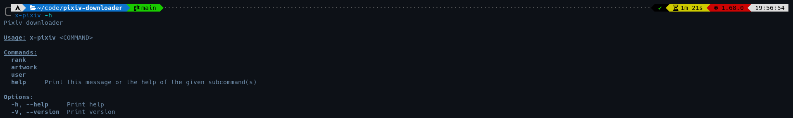
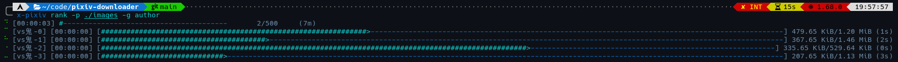
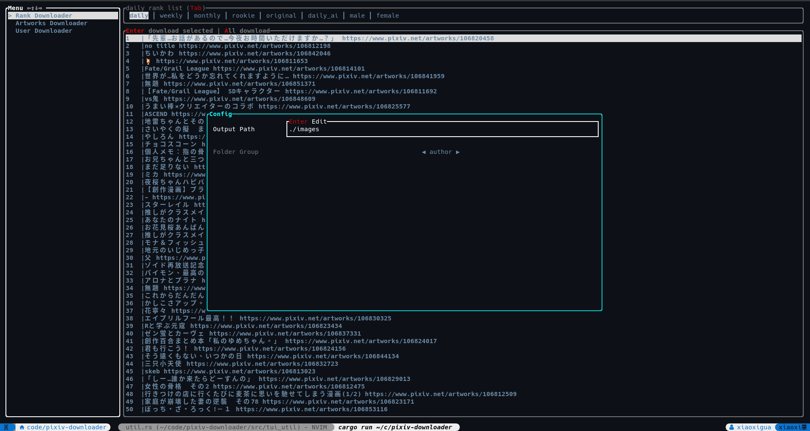
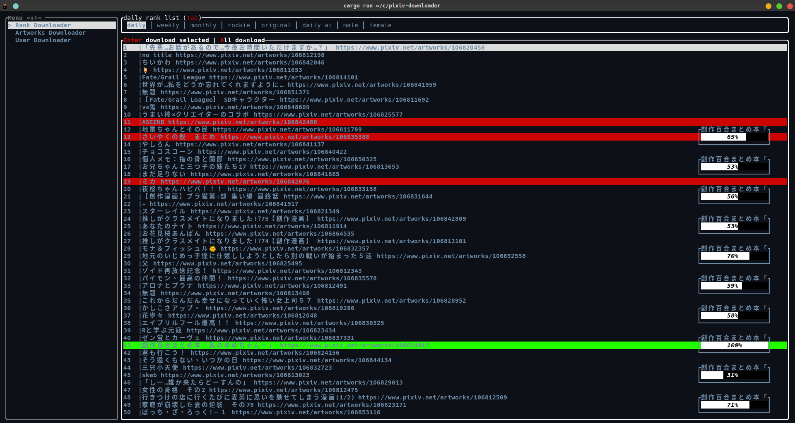

# XPixiv
This a simple pixiv downloader

## Features
- Cross-platform (Linux, macOS, Windows)
- Asynchronous IO operations to avoid UI locking
- Have command-line interface and Text-based user interface

## Installation

### Binary releases
- Download x-pixiv-(VERSION)-(ARCH)-(PLATFORM).(zip|tar.gz) from [latest release](https://github.com/xiaoxigua-1/XPixiv/releases/latest) and unpack to a new folder

### Cargo
```bash
cargo install x-pixiv
```

### Arch Linux
```bash
yay install x-pixiv-bin
```

### Ubuntu

#### Amd64
```bash
wget https://github.com/xiaoxigua-1/XPixiv/releases/download/latest/x-pixiv_0.1.6_amd64.deb
sudo apt install ./x-pixiv_0.1.6_amd64.deb
```

#### Arch64
```bash
wget https://github.com/xiaoxigua-1/XPixiv/releases/download/latest/x-pixiv_0.1.6_arm64.deb
sudo apt install ./x-pixiv_0.1.6_arm64.deb
```

## CLI
Input `x-pixiv -h` show help.


## TUI
Open x-pixiv


